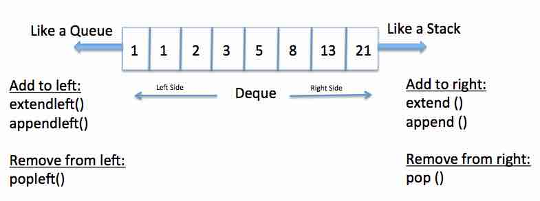

## 스택과 큐

#### 스택

쌓는다는 의미로서, 마치 접시를 쌓고 빼듯이 **데이터를 한쪽에서만 넣고 빼는 자료구조** 가장 마지막에 들어온 데이터가 가장 먼저 나오므로 LIFO(Last-in-First-Out, 후입선출) 방식 

**스택이 사용되는 곳**

* 뒤집기, 되돌리기, 되돌아가기
* 마무리 되지 않은 일을 임시 저장할때
* 괄호 매칭, 함수 호출(재귀 호출), 백트래킹, DFS(깊이 우선 탐색)

**파이썬은 리스트(List)로 스택을 간편하게 사용할 수 있다.**

 

#### 큐(Queue) 

**한 쪽 끝에서 데이터를 넣고, 다른 한 쪽에서만 데이터를 뺄 수 있는 자료구조** 가장 먼저 들어온 가장 먼저 나가므로 FIFO(First-in First-out, 선입선출) 방식이라고 한다.

**리스트를 이용한 큐 자료구조의 단점**

데이터를 뺄 때 큐 안에 있는 데이터가 많은 경우 비효율적이다(O(N))

맨 앞 데이터가 빠지면서, 리스트의 인덱스가 하나씩 당겨지기 때문이다.

 

**덱(Deque, Double-Ended Queue) 자료구조**

양 방향으로 삽입과 삭제가 자유로운 큐

덱은 양 방향 삽입, 추출이 모두 큐보다 훨씬 빠르다.